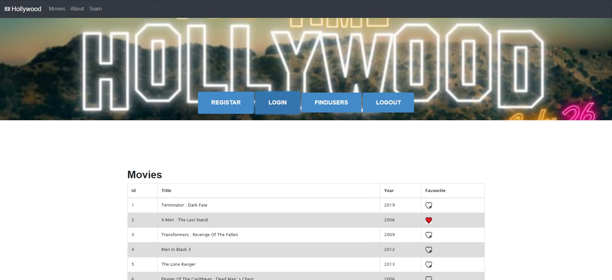
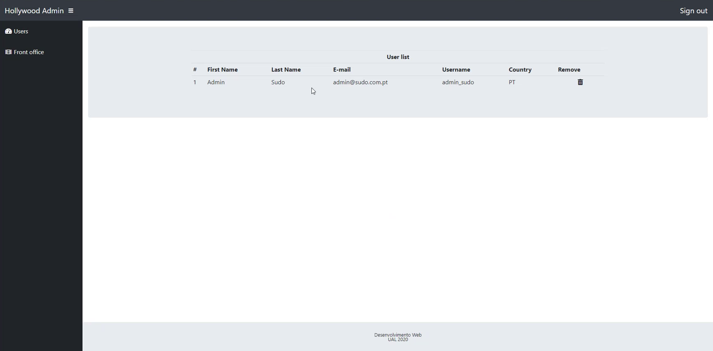

# DWEB
Academic project designed for a Web Development curricular unit.

## Project's Description
It consists of a simple single-page application about movies. It also has a basic administration interface for managing both users and the movie database.
### Operations
Users can:
- Login/Register
- Search Users
- Search Movies
- Mark/unmark Movies as favourites

## Project Development
### Examples
|  |
|:--:|
| *Web-site* |

|  |
|:--:|
| *admin-site* |

### Architecture and Tools
- The back-end was made on [node.js](https://nodejs.org) ([Express.js](https://expressjs.com/) framework, [Passport.js](https://www.passportjs.org/) for authentication), served by a [MySQL](https://www.mysql.com/) database. 
- Developed in VSCode
 
#### Disclamer: This is an academic work, developed solely for educational purposes, it is not tested or ready for a production environment

## License & copyright
© [Artur Fernandes](https://github.com/Artur30002667), [Miguel Alves](https://github.com/mogilev), [Valter Vitorino](https://github.com/valtervitorino)

Licensed under the [MIT License](LICENSE)
